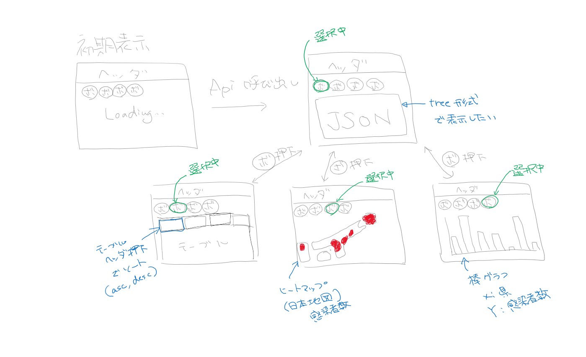
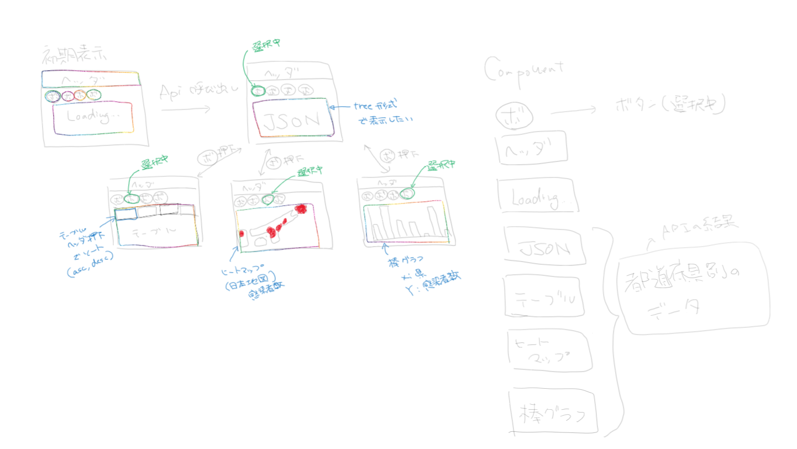

# コロナApiを使ってデータを可視化してみる
by [@saijo_shota_biz](https://twitter.com/saijo_shota_biz)

---

## アジェンダ
- 自己紹介
- コロナAPI is 何？
- 可視化してみた
  - 設計
  - 成果物
  - 見てみる
- 作ってみた感想
- WEB API 紹介

---

## 自己紹介


--

```json
{
  "名前": "さいじょー",
  "年齢": "26",
  "経歴": [
    "正社員(3年半くらい)",
    "フリーランス(3か月)"
  ],
  "仕事": [
    "フロントエンドエンジニア",
    "メンター(Java)"
  ],
}
```

--

```json
{
  "スキル": [
    { "Java": "3年半" },
    { "Vue": "１年半" },
    { "Angular": "3か月" },
    { "React": "勉強中" },
    { "PHP(laravel)": "勉強中" }
  ],
  "趣味": [
    { "漫画": ["ONE PIECE", "ヒロアカ", "その他もろもろ"] },
    { "日本酒": ["賀茂鶴", "半蔵", "酔鯨", "獺祭"] }
  ],
  "楽しみ": ["淀川花火大会", "広島酒祭り"],
}
```

---

## コロナAPI is 何？

日本の都道府県ごとのCOVID-19（コロナウイルス）情報を取得するためのWeb API

- [Github](https://github.com/ryo-ma/covid19-japan-web-api/blob/master/README.ja.md)
- [Swagger](https://covid19-japan-web-api.now.sh/apidocs/)

↓試す↓
```bash
curl --location --request GET 'https://covid19-japan-web-api.now.sh/api//v1/prefectures'
```

--

### Web API is 何？

> 広義にはHTTPプロトコルを用いてネットワーク越しに呼び出すアプリケーション間、システム間のインターフェースのこと。 APIの機能はわかっているけれども、その中身の実際の動作は詳しくわからない(知らなくてもよい)機能の塊を、外部から呼び出す仕様のことを指す。

--

### よき
- Json形式で返却
- 登録不要で使用可能
- シンプルなデータ構造
- 日本語ドキュメントがある

---

## 可視化してみた

--

### 設計



--

### コンポーネント分割



--

### 実装

--

#### 使用したライブラリ紹介

- [react-json-tree](https://www.npmjs.com/package/react-json-tree)
  - JSON コンポーネントに使用

- [Recharts](https://recharts.org/en-US/)
  - 棒グラフ コンポーネントに使用

- [日本地図](https://github.com/tektoh/japan-map)
  - ライブラリではないが、ヒートマップコンポーネントの作成時に参考にした。

--

#### 工数

- 設計 2H
- 実装
  - ボタン 0.5H
  - ヘッダ 0.5H
  - JSON 0.5H
  - ヒートマップ 3H
  - テーブル 3H
  - 棒グラフ 0.5H
- デプロイ 0.5H

--

## 見てみる

[成果物](https://saijo-shota-biz.github.io/covid-19/)

---

## 作ってみた感想

- ヒートマップは意外と簡単にできた。
- Rechartsは結構勉強する価値ありそう。
- 感染者にしか注目していないが、死者数や重症者数などいろいろなデータを使用すればよかった。
- ちょっとシンプルすぎたかな。
- コロナAPIはかなり使いやすくておススメ.

---

## 最後に
### WEB API 紹介

- コロナAPI
  - https://github.com/ryo-ma/covid19-japan-web-api/blob/master/README.ja.md
- POKE API
  - https://pokeapi.co/
- DMM API
  - https://affiliate.dmm.com/api/

--

[public-apis](https://github.com/public-apis/public-apis)

無料で使用できる公開APIをまとめたサイト.

---

## ありがとうございました。
よかったらフォローしてください。
[@saijo_shota_biz](https://twitter.com/saijo_shota_biz)